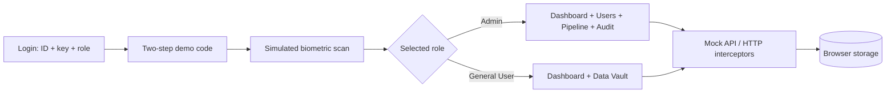
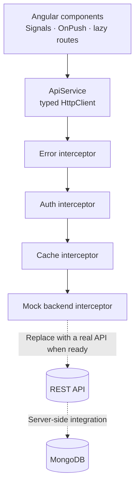

<div align="center">


# 🛡️ TrustVault Core

### A digital vault with role-based access, verification steps, audit trails, and an animated 3D experience.

[](https://angular.dev/)
[](https://www.typescriptlang.org/)
[](https://nodejs.org/)
[](https://www.mongodb.com/)
[](https://rxjs.dev/)
[](https://tailwindcss.com/)
[](https://threejs.org/)
[](https://www.netlify.com/)

**[🚀 Open Live Demo](https://6ac8e1b207a551d166230684--trustvault-vaibhav-demo.netlify.app/dashboard)** · **[🌐 Visit Website](https://6ac8e1b207a551d166230684--trustvault-vaibhav-demo.netlify.app/)** · **[🔌 API Contract](API.md)** · **[☁️ Deployment Guide](DEPLOY_GUIDE.md)** · **[📤 GitHub Guide](GITHUB_GUIDE.md)**

</div>

---

## 📌 Project Overview

**TrustVault Core** is a security-themed web application demo built with Angular. It demonstrates role-based access, a two-step verification flow, simulated biometric scanning, record management, audit history, responsive dashboard widgets, and an animated Three.js background.

The project also demonstrates frontend engineering concepts used in modern web applications: reusable Angular components, TypeScript, RxJS streams, HTTP interceptors, route guards and resolvers, lazy-loaded features, form validation, and browser-side persistence.

> **Demo notice:** This is a demonstration application. Sample users, codes, records, and audit data are fictional. Do not enter real passwords, confidential information, or production data. The current mock-backend setup is not a substitute for production authentication or secure server-side storage.

## 🔗 Live Website

- **Dashboard demo:** [Open TrustVault Core](https://6ac8e1b207a551d166230684--trustvault-vaibhav-demo.netlify.app/dashboard)
- **Website home:** [Open deployed website](https://6ac8e1b207a551d166230684--trustvault-vaibhav-demo.netlify.app/)

If the dashboard URL requires a session, open the website home first and sign in using the demo credentials below.

## 🧒 What Is This? (Explained Simply)

Imagine a treasure vault in a spy movie.

| In the movie | In TrustVault Core |
|---|---|
| 🚪 A guard asks who you are | The login page asks for an operator ID, security key, and role |
| 🔢 A guard asks for a secret code | The demo two-step verification screen accepts a six-digit code and shows a countdown |
| 👁️ A scanner checks you | A simulated biometric-scan animation changes the 3D scene |
| 🗄️ Some drawers are restricted | Confidential records and administrative actions are role-restricted in the demo UI |
| 📜 A notebook records activity | The Audit Ledger records demo actions, with a Web Worker integrity-check demonstration |
| 😴 The guard locks the vault after inactivity | An idle timeout signs out the demo session after inactivity |

---

## ⚡ Try It in 60 Seconds

Use the fictional demo credentials shown below, or use the one-click demo buttons on the login screen if available.

| Demo role | Operator ID | Security key | Role |
|---|---|---|---|
| 👑 Administrator | `admin` | `admin` | Admin |
| 🙂 General user | `priya` | `priya` | General User |
| 🔢 Demo verification code | `123456` | — | Enter on the verification step |

These credentials are for the demo only. Do not reuse them for any real account.

## ✨ Features

| # | Feature | Where to find it | Main concept demonstrated |
|---:|---|---|---|
| 1 | Live multi-filtering | Data Vault → Fetch Records | RxJS `combineLatest`, reactive form values |
| 2 | Offline-first demo cache | Toggle server status and reload data | HTTP interceptors, `localStorage` |
| 3 | Asynchronous form validation | Manage Users → Register Operator | `AsyncValidatorFn`, `timer`, `switchMap` |
| 4 | Clearance-based UI | Admin-only actions | Custom structural directive |
| 5 | Idle auto-logout | Leave the app inactive | `fromEvent`, RxJS timer streams |
| 6 | Personal data masking | Open a record and use the visibility control (Admin) | Host listener/directive concepts |
| 7 | Record reveal modal | Open a record | Modal state, CSS effects, RxJS timer |
| 8 | Periodic status updates | Record modal | `interval`, `switchMap` |
| 9 | Kanban drag and drop | Pipeline (Admin) | Angular CDK drag-and-drop |
| 10 | Two-step verification | Login step two | `timer`, `takeWhile` |
| 11 | Reusable projected content | Cards, widgets, and modals | Angular content projection, `<ng-content>` |
| 12 | Route data resolution | Pipeline route | Angular `ResolveFn` |
| 13 | Toast notifications | App notifications | RxJS `Subject` and services |
| 14 | Lifecycle stepper | Record modal | Timed state changes |
| 15 | Page transitions | Navigate between pages | Angular animations |
| 16 | Integrity gauge | Dashboard and record modal | SVG stroke-dash styling |
| 17 | Dynamic dashboard widgets | Dashboard → Add Widget (Admin) | `ViewContainerRef.createComponent` |
| 18 | 3D node graph | Add the Verification Node Graph widget | Three.js |
| 19 | Virtual audit scrolling | Audit Ledger | Angular CDK scrolling |
| 20 | Anomaly heatmap | Dashboard | Angular template control flow and dynamic classes |
| 21 | Background integrity worker | Audit → Verify chain in Web Worker | Web Workers |
| 22 | PDF report export | Record modal (Admin) | jsPDF, html2canvas |
| 23 | CSV export | Data Vault | `Blob`, browser download |
| 24 | Three-language UI | Language menu | English, తెలుగు, हिन्दी; translation pipe/service |

**Additional UI details:** persistent 3D background scene, glass-style panels, hover tilt effects, scan mode, responsive layouts, and demo data that can persist in browser storage between refreshes.

> Feature availability may depend on the current deployed build. This README describes the project's intended demo functionality.

## 🧰 Technology Stack

### Frontend

- **Angular 18** — standalone components, feature-based structure, routing, dependency injection, and application lifecycle.
- **TypeScript 5.5** — typed application code and maintainable interfaces.
- **RxJS 7** — asynchronous events, reactive streams, polling, and request coordination.
- **Angular CDK** — drag-and-drop and scrolling utilities.
- **Angular Forms** — form state and validation.
- **Tailwind CSS 3** — utility-first styling and responsive UI.
- **Three.js** — animated 3D background and node-graph visualization.
- **jsPDF and html2canvas** — demo PDF export.
- **HTML, CSS, and SVG** — layout, visual effects, and dashboard indicators.

### API and Backend Concepts

- **Angular `HttpClient`** for typed HTTP requests.
- **REST API concepts** for client/server communication.
- **HTTP interceptors** for errors, authentication flow, caching, and mock API responses.
- **Node.js and Express** are suitable options for building a separate real backend API.
- **MongoDB** can be used as the database for persistent users, records, and audit events when a real backend is implemented.
- **Environment-based configuration** for API URLs and deployment settings.

**Implementation note:** the current demo uses a mock backend/interceptor and browser persistence. Node.js, Express, and MongoDB are listed as backend integration technologies, not as a claim that a production MongoDB server is already connected. A real implementation should validate permissions and store secrets on the server, not in frontend code or `localStorage`.

### Cloud and Deployment

- **Netlify** for hosting the frontend and supporting serverless functions.
- **Netlify redirects/configuration** for single-page-app routing.
- **Cloud API integration** through environment-specific API endpoints.
- **Production deployment concepts:** build commands, publish directories, environment variables, HTTPS, CORS, server-side validation, and secure secret management.

## 🧠 How It Works

### User flow



### Request flow



The mock backend allows the frontend demo to run without requiring a separate API server. For a real deployment, connect Angular to a backend that performs authentication, authorization, validation, and database operations securely.

## 🗂️ Project Folder Structure

```text
trustvault-core/
├── src/
│   ├── index.html
│   ├── main.ts
│   ├── styles.css
│   └── app/
│       ├── app.component.ts
│       ├── app.config.ts
│       ├── app.routes.ts
│       ├── core/        # Services, interceptors, guards, resolvers, mock API, i18n
│       ├── shared/      # Reusable cards, gauges, heatmaps, stepper, directives, pipes
│       ├── scene/       # Three.js background
│       ├── auth/        # Login, demo verification, biometric-scan animation
│       ├── shell/       # Sidebar, header, transitions, idle banner
│       ├── dashboard/   # Dashboard page
│       ├── workspace/   # Dynamic widgets
│       ├── records/     # Data Vault and record modal
│       └── admin/       # Users, Kanban pipeline, audit ledger, Web Worker
├── public/
│   └── _redirects       # SPA routing support
├── single-file/         # Standalone one-file demo, if included in this repository
├── docs/
│   └── banner.svg       # Animated README banner
├── netlify/
│   └── functions/       # Netlify serverless functions, if configured
├── angular.json
├── package.json
├── tailwind.config.js
├── netlify.toml
├── vercel.json
├── API.md
├── GITHUB_GUIDE.md
├── DEPLOY_GUIDE.md
└── README.md
```

The structure above documents the intended organization. Some optional folders or configuration files may differ in your checked-out version.

## 🖥️ Run Locally

### Requirements

- [Node.js](https://nodejs.org/) 18.19+ or a compatible Node.js 20 installation.
- npm.
- Git (recommended).

### Install and start

```bash
npm install
npm start
```

Open [http://localhost:4200](http://localhost:4200) in your browser.

### Build for production

```bash
npm run build
```

The configured production output is expected under `dist/client/browser`. Check `angular.json` and `package.json` if your local build uses a different output directory.

## ☁️ Deployment on Netlify

1. Push the project to a GitHub repository.
2. Sign in to [Netlify](https://www.netlify.com/) and import the repository.
3. Configure the build command and publish directory to match the repository's `netlify.toml` and Angular build output.
4. Add required environment variables in Netlify site settings.
5. Deploy and open the generated website URL.
6. Test direct navigation to `/dashboard` and refresh the page to verify SPA redirects.
7. If the app uses serverless functions, confirm the function directory and required environment variables are configured.

**Live demo:** [TrustVault Core Dashboard](https://6ac8e1b207a551d166230684--trustvault-vaibhav-demo.netlify.app/dashboard)

## 🔌 Connecting a Real Backend

The current demo is configured around a mock API. To connect a real service:

1. Review `src/app/core/api.config.ts` and the API service.
2. Set the real API URL using environment-specific configuration.
3. Implement the API using Node.js with a framework such as Express, if desired.
4. Connect the server to MongoDB using server-side database credentials.
5. Implement server-side login, password hashing, role checks, input validation, and authorization.
6. Configure CORS and HTTPS for the deployed frontend and API.
7. Store API secrets in backend/cloud environment variables; never bundle secrets in Angular.
8. Update `API.md` to document actual endpoints and request/response shapes.

Do not simply disable the mock backend until a real API is available and configured. A frontend role selector or hidden button is not a security boundary; the backend must enforce every protected operation.

## 🔌 API Contract

See **[API.md](API.md)** for the documented API contract included with the repository. Confirm that its endpoints match the currently configured mock backend before connecting a production service.

Typical real-backend resources could include:

| Resource | Example responsibility |
|---|---|
| Authentication | Sign-in, session/token handling, sign-out |
| Users | Create, suspend, restore, and list user accounts |
| Records | Fetch and filter records based on permissions |
| Audit events | Append and retrieve security-related activity |
| Dashboard | Return summary data and widget information |

These are integration suggestions, not a statement that each endpoint is currently implemented.

## 🎯 Internship Challenge Checklist

| Requirement | Where / how it is demonstrated |
|---|---|
| Angular 12+ single-page application | Built with Angular 18, standalone components, and lazy routes |
| Login with ID, password/key, and role | Authentication demo screens |
| Dummy API that stores and returns responses | Mock-backend interceptor and mock data |
| User details and access-level records | Dashboard and Data Vault |
| Admin user management | Manage Users: create, suspend, and restore demo users |
| API delays and asynchronous processing | Mock request delays, polling, worker task, progress UI |
| Restore user/session on app load | App initialization/session restoration, where configured |
| Modular and maintainable code | `core`, `shared`, and feature folders |
| Angular framework and libraries | Angular, RxJS, Angular CDK, forms, routing |
| API integration knowledge | Typed `HttpClient`, interceptors, mock API, REST concepts |
| Cloud deployment knowledge | Netlify configuration and SPA deployment |
| Database integration pathway | Node.js API + MongoDB integration plan |

## 📚 Skills Demonstrated

- Angular framework and modern Angular application structure
- TypeScript and typed service design
- RxJS observables and reactive programming
- Angular routing, guards, resolvers, forms, and dependency injection
- Reusable components, directives, and pipes
- Angular CDK drag-and-drop and virtual scrolling
- REST API concepts and `HttpClient`
- Error handling, caching concepts, and interceptors
- Node.js backend architecture concepts
- MongoDB integration planning
- Cloud deployment using Netlify
- Responsive UI development with Tailwind CSS
- Three.js visualization and SVG animation
- CSV/PDF export and Web Worker concepts
- Git/GitHub project organization

## 🛠️ Troubleshooting

### README banner does not appear

- Check that the file exists at `docs/banner.svg`.
- Ensure the filename and capitalization match exactly.
- Commit and push the SVG file to the repository.
- If you want a self-contained README without an external banner file, remove the `` line at the top; the README will still render, but it will not show that animated SVG.

### Mermaid diagram shows an error

- Keep each diagram inside a fenced block labelled `mermaid`.
- Use quoted node labels, as in the diagrams above.
- Avoid copying HTML page markup into the diagram source.
- Check the diagram preview in GitHub after pushing.

### Netlify build fails

- Confirm the repository base directory is the folder containing `package.json`.
- Confirm the configured build command matches the scripts in `package.json`.
- Confirm the publish directory matches the actual Angular build output.
- Check `netlify.toml` for conflicting base or publish settings.
- Review the Netlify deploy log for the first actual error rather than only the final failure message.

### Dashboard route returns a 404 on refresh

Configure the Netlify SPA redirect so application routes serve `index.html`. Check the repository's `_redirects` file or `netlify.toml`.

### Real API requests fail

Check the API base URL, server availability, CORS configuration, environment variables, and server logs. Do not put database credentials or private API secrets in frontend files.

## 🗺️ Roadmap Ideas

- Connect a Node.js/Express REST API.
- Add MongoDB persistence through the backend.
- Replace demo authentication with secure server-side authentication.
- Add automated unit and integration tests.
- Add CI checks for linting, tests, and production builds.
- Add monitoring and structured server-side audit logging.
- Improve accessibility and test responsive layouts across screen sizes.

## 📜 License

MIT, if the repository's `LICENSE` file confirms this license. Demo data is fictional. If no license file exists yet, add one before presenting the project as MIT-licensed.

---

<div align="center">

**Built with Angular, TypeScript, RxJS, and a cyan-glow security-vault aesthetic.**

[🚀 Launch Demo](https://6ac8e1b207a551d166230684--trustvault-vaibhav-demo.netlify.app/dashboard) · [🌐 Open Website](https://6ac8e1b207a551d166230684--trustvault-vaibhav-demo.netlify.app/)

</div>

---

## Appendix: Animated `docs/banner.svg`

Save the following SVG code as `docs/banner.svg`. The README references this file at the top. GitHub can render the SVG's animation when it is hosted in the repository.

```svg
<svg xmlns="http://www.w3.org/2000/svg" width="1200" height="360" viewBox="0 0 1200 360" role="img" aria-label="TrustVault Core animated banner">
  <defs>
    <linearGradient id="bg" x1="0" y1="0" x2="1" y2="1">
      <stop offset="0" stop-color="#02040a"/>
      <stop offset="1" stop-color="#0a1226"/>
    </linearGradient>
    <linearGradient id="tx" x1="0" y1="0" x2="1" y2="0">
      <stop offset="0" stop-color="#00f0ff"/>
      <stop offset="1" stop-color="#b535f6"/>
    </linearGradient>
    <radialGradient id="gl">
      <stop offset="0" stop-color="#00f0ff" stop-opacity=".45"/>
      <stop offset="1" stop-color="#00f0ff" stop-opacity="0"/>
    </radialGradient>
  </defs>

  <rect width="1200" height="360" fill="url(#bg)"/>

  <g opacity=".5" stroke="#00f0ff" stroke-opacity=".08">
    <path d="M0 60H1200M0 120H1200M0 180H1200M0 240H1200M0 300H1200"/>
    <path d="M100 0V360M300 0V360M500 0V360M700 0V360M900 0V360M1100 0V360"/>
  </g>

  <g transform="translate(930 180)">
    <circle r="150" fill="url(#gl)">
      <animate attributeName="r" values="140;165;140" dur="4s" repeatCount="indefinite"/>
    </circle>

    <g fill="none" stroke-width="2">
      <circle r="60" stroke="#00f0ff">
        <animateTransform attributeName="transform" type="rotate" from="0" to="360" dur="14s" repeatCount="indefinite"/>
      </circle>
      <ellipse rx="100" ry="38" stroke="#b535f6">
        <animateTransform attributeName="transform" type="rotate" from="0" to="-360" dur="9s" repeatCount="indefinite"/>
      </ellipse>
      <ellipse rx="130" ry="60" stroke="#ff003c" stroke-opacity=".7">
        <animateTransform attributeName="transform" type="rotate" from="30" to="390" dur="18s" repeatCount="indefinite"/>
      </ellipse>
    </g>

    <g fill="#00f0ff">
      <circle cx="60" cy="0" r="6">
        <animateTransform attributeName="transform" type="rotate" from="0" to="360" dur="5s" repeatCount="indefinite"/>
      </circle>
    </g>

    <rect x="-26" y="-18" width="52" height="40" rx="8" fill="#02040a" stroke="#00f0ff" stroke-width="3"/>
    <path d="M-14 -18v-12a14 14 0 0 1 28 0v12" fill="none" stroke="#00f0ff" stroke-width="3"/>
    <circle cy="2" r="5" fill="#00f0ff">
      <animate attributeName="opacity" values="1;.2;1" dur="1.6s" repeatCount="indefinite"/>
    </circle>
  </g>

  <text x="70" y="150" font-family="Arial,Helvetica,sans-serif" font-size="30" letter-spacing="10" fill="#22d3ee">TRUSTVAULT</text>
  <text x="66" y="235" font-family="Arial,Helvetica,sans-serif" font-size="96" font-weight="700" fill="url(#tx)">CORE</text>
  <text x="70" y="280" font-family="monospace" font-size="17" fill="#94a3b8">ANGULAR · TYPESCRIPT · NODE.JS · MONGODB · CLOUD</text>
  <text x="70" y="308" font-family="monospace" font-size="16" fill="#64748b">APIs · RXJS · THREE.JS · ANGULAR CDK</text>
  <rect x="70" y="325" width="260" height="3" fill="#00f0ff">
    <animate attributeName="width" values="40;260;40" dur="5s" repeatCount="indefinite"/>
  </rect>
</svg>
```
