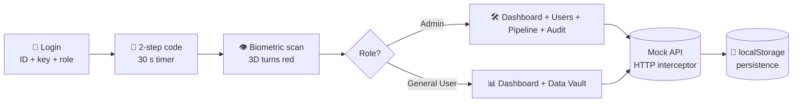
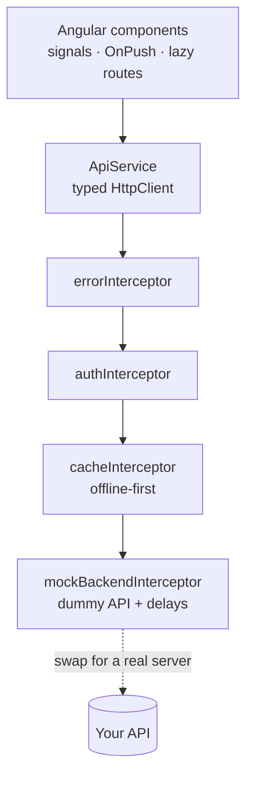

<div align="center">



# 🛡️ TrustVault Core
### *A digital vault with guards, secret codes and a spinning 3D brain.*


**[🚀 Live demo](https://YOUR-SITE-NAME.netlify.app)** &nbsp;·&nbsp; **[🔌 API contract](API.md)** &nbsp;·&nbsp; **[☁️ Deploy guide](DEPLOY_GUIDE.md)** &nbsp;·&nbsp; **[📤 GitHub guide](GITHUB_GUIDE.md)**

</div>

---

## 🧒 What is this? (explained for a 10-year-old)

Imagine a **treasure vault** in a spy movie.

| In the movie | In this website |
|---|---|
| 🚪 The guard asks *"Who are you?"* | The **login page** asks for an ID, a key and your role (Admin or General User) |
| 🔢 The guard texts you a secret code | The **2-step verification** asks for a 6-digit code that expires in 30 seconds |
| 👁️ A laser scans your eye | The **biometric scan** animation turns the 3D world red |
| 🗄️ Some drawers are locked for visitors | **Confidential files** stay locked unless you are an Admin |
| 📜 A notebook writes down everything | The **Audit Ledger** records every action, and a robot (Web Worker) checks it was never changed |
| 😴 The guard locks up if you fall asleep | **Idle logout** locks the vault after 60 seconds of doing nothing |

> ⚠️ **It is a demo.** All people, numbers and files are made up. No real data is ever used.

---

## ⚡ Try it in 60 seconds

| Who | Operator ID | Security key | Role to pick |
|---|---|---|---|
| 👑 Admin (sees everything) | `admin` | `admin` | **Admin** |
| 🙂 General user (limited) | `priya` | `priya` | **General User** |
| 🔢 2-step code (demo) | `123456` | | |

The login page also shows these on screen, with one-click buttons.

---

## ✨ 24 pro features (and where to find them)

<details open>
<summary><b>Click to open the full list</b></summary>

| # | Feature | Where to see it | Angular / RxJS idea |
|---|---|---|---|
| 1 | Live multi-filter | **Data Vault** → *Fetch Records* → search + dropdowns | `combineLatest` + `valueChanges` |
| 2 | Offline-first cache | Header **SERVER UP/DOWN** button, then reload data | HTTP interceptor + `localStorage` |
| 3 | Async validator | **Manage Users** → *Register Operator* → type an ID | `AsyncValidatorFn`, `timer`, `switchMap` |
| 4 | `*hasClearance` directive | Admin-only buttons everywhere | Structural directive |
| 5 | Idle auto-logout | Stay still for 50 s | `fromEvent` + `switchMap(timer)` |
| 6 | PII masking | Open a record → **hold** the 👁 icon (Admin) | `@HostListener` directive |
| 7 | Decryption modal | Click any open record | CSS blur + RxJS `timer` |
| 8 | Real-time polling | Modal status updates every 3 s | `interval` + `switchMap` |
| 9 | Kanban drag & drop | **Pipeline** (Admin) | Angular CDK drag-drop |
| 10 | 2-step verification | Login step 2 (30 s countdown) | `timer` + `takeWhile` |
| 11 | Content projection | Every glass card / widget / modal | `<ng-content select>` |
| 12 | Route resolver | **Pipeline** loads data *before* opening | `ResolveFn` |
| 13 | Toast notifications | Bottom of the screen | `Subject` service |
| 14 | Lifecycle stepper | Inside the record modal | `timer` + `take` |
| 15 | Page transitions | Click between pages | `@angular/animations` |
| 16 | Integrity gauge | Dashboard + modal | SVG `stroke-dashoffset` |
| 17 | Dynamic dashboard | Dashboard → **+ Add Widget** (Admin) | `ViewContainerRef.createComponent` |
| 18 | 3D node graph | Add the *Verification Node Graph* widget | Three.js |
| 19 | Virtual scrolling | **Audit Ledger** → 10,000 events | CDK `ScrollingModule` |
| 20 | Anomaly heatmap | Dashboard | `@for` + dynamic classes |
| 21 | Web Worker | Audit → *Verify chain in Web Worker* | `new Worker(new URL(...))` |
| 22 | PDF export | Record modal → *Export PDF report* (Admin) | `jsPDF` + `html2canvas` |
| 23 | CSV export | Data Vault → *Export CSV* | `Blob` + download |
| 24 | 3 languages | Top-right language menu (English / తెలుగు / हिन्दी) | Signal-based translate pipe |

</details>

**Plus:** a persistent 3D scene that glides between pages, tilt-on-hover cards, a scanning mode, and saved data (users, Kanban moves and your own audit events survive a refresh).

---

## 🧠 How it works





---

## 🗂️ Folder map

```text
trustvault-core/
├─ src/
│  ├─ index.html · main.ts · styles.css
│  └─ app/
│     ├─ app.component.ts · app.config.ts · app.routes.ts
│     ├─ core/        services, interceptors, guards, resolvers, mock API, i18n
│     ├─ shared/      reusable pieces: card, gauge, heatmap, stepper, directives, pipes
│     ├─ scene/       the 3D background (Three.js)
│     ├─ auth/        login + 2-step code + biometric scan
│     ├─ shell/       sidebar, header, page transitions, idle banner
│     ├─ dashboard/   dashboard page
│     ├─ workspace/   dynamic widgets
│     ├─ records/     Data Vault + decryption modal
│     └─ admin/       users, pipeline (Kanban), audit ledger, web worker
├─ public/            _redirects (single-page-app fix)
├─ single-file/       the whole demo in ONE html file
├─ docs/              banner
├─ angular.json · package.json · tsconfig*.json · tailwind.config.js
├─ netlify.toml · vercel.json
└─ README.md · API.md · GITHUB_GUIDE.md · DEPLOY_GUIDE.md
```

---

## 🧪 Run it on your computer

```bash
npm install        # downloads the tools (about 2 minutes)
npm start          # opens http://localhost:4200
npm run build      # makes the production site in dist/client/browser
```

Uses **Node.js 22.22.0**, pinned in `.nvmrc` and `netlify.toml` to satisfy the Netlify Angular runtime plugin ([download](https://nodejs.org)).

## ☁️ Put it on the internet (free, 24/7)

Read **[DEPLOY_GUIDE.md](DEPLOY_GUIDE.md)**: connect this repo to Netlify, and it builds and publishes itself. `netlify.toml` already has the right settings.

## 🔌 Want a real backend later?

Open `src/app/core/api.config.ts`, set `USE_MOCK = false` and point `API_URL` at your server. The endpoints are listed in **[API.md](API.md)**.

---

## 🎯 Internship challenge checklist

| Requirement from the brief | Where it is |
|---|---|
| Angular 12+ SPA | Angular 18 (standalone components, signals, lazy routes) |
| Login with User ID, password, role (General User / Admin) | `auth/login.component.ts` |
| Dummy API that stores & returns responses | `core/mock-backend.interceptor.ts` + `core/mock-data.ts` (persisted in the browser) |
| Logged-in page shows user details + records table by access level | Dashboard + Data Vault |
| Admin user management | Manage Users (create, suspend, restore) |
| API delay by parameter + async processing | Delays on every call, polling, 10,000-row worker hash, progress bars |
| Load User Service on app load / modular code | `APP_INITIALIZER` restores the session; feature folders are lazy loaded |
| Creative design + clean architecture | 3D scene, glass UI, `core / shared / features` structure |

## 🧰 Tech

Angular 18 · TypeScript 5.5 (strict) · RxJS 7 · Angular CDK · Tailwind CSS 3 · Three.js r128 · jsPDF · html2canvas

## 📜 License

MIT: free to learn from and build on. Demo data is fictional.

<div align="center"><sub>Built with ❤️, Angular and a lot of 🧊 cyan glow.</sub></div>
